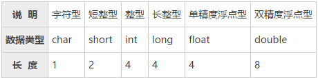

# C语言基础学习
```
内存中数据的存储
内存条是一个非常精密的部件，包含了上亿个电子元器件，它们很小，达到了纳米级别。
这些元器件，实际上就是电路；电路的电压会变化，要么是 0V，要么是 5V，只有这两种电压。
5V 是通电，用1来表示，0V 是断电，用0来表示。所以，一个元器件有2种状态，0 或者 1。
1个元器件称为1比特（Bit）或1位，8个元器件称为1字节（Byte），那么16个元器件就是2Byte，32个就是4Byte，以此类推：
8×1024个元器件就是1024Byte，简写为1KB；
8×1024×1024个元器件就是1024KB，简写为1MB；
8×1024×1024×1024个元器件就是1024MB，简写为1GB。
```

## C语言变量及类型
在定义变量时还要指明数据的长度。而这恰恰是数据类型的另外一个作用。
数据类型除了指明数据的解释方式，还指明了数据的长度。因为在C语言中，每一种数据类型所占用的字节数都是固定的，知道了数据类型，也就知道了数据的长度。



### 整数&浮点数

```C
#include <stdio.h>
int main()
{
    short a = 10;
    int b = 100;
    long c = 1000;
    char d = 'X';
   
    int a_length = sizeof a;
    int b_length = sizeof(int);
    printf("a=%d, b=%d, c=%d, d=%d\n", a_length, b_length, sizeof(c), sizeof(char));
    return 0;
}
```

__在符号位中，用0表示正数，用1表示负数。__
例如 int 类型的 -10、+16 在内存中的表示如下：


当数值过大或过小时，有限的几个字节就不能表示，就会发生溢出。发生溢出时，最高位会被截去。

```C
#include <stdio.h>
int main()
{
    unsigned int a = 0x100000000;
    int b = 0xffffffff;
    printf("a=%u, b=%d\n", a, b);
    return 0;
}
```

__计算机中，数值一律采用补码形式表示。__
+ 正数补码，反码就是其原码，正数的原码就是其二进制
+ 负数补码是其反码+1，负数的反码是将原码中除符号位以外的每一位取反
例如，16-9 = 16+(-9)，16 的补码为 0001 0000，-9 的原码为 1000 1001，补码为 1111 0111。我们可以直接将两个数的补码相加：
```
1111 0111 + 0001 0000 = 1 0000 0111
```
最高位的1溢出，被截去，内存中最后剩下 0000 0111，也就是7。

__%f 默认保留六位小数，不足六位以 0 补齐，超过六位按四舍五入截断。__


+ float和double的精度是由尾数的位数来决定的。
+ float：2^23 = 8388608，一共七位，这意味着最多能有7位有效数字，但绝对能保证的为6位，也即 float 的精度为 6~7 位有效数字。
+ double：2^52 = 4503599627370496，一共16位，同理，double 的精度为 15~16 位。
+ float 的取值范围为 -2^128 ~ +2^128，也即 -3.40E+38 ~ +3.40E+38
+ double 的取值范围为 -2^1024 ~ +2^1024，也即 -1.79E+308 ~ +1.79E+308

__C语言把整数作为定点数，而把小数作为浮点数。定点数必须转换为补码再写入内存，浮点数没有这个过程，直接写入原码。__

### 字符

单引号引起来的叫字符，双引号引起来的叫字符串
printf 格式控制字符的完整形式如下：
```
%[flags][width][.precision]type
```
对于整数和小数，默认右对齐，不足的宽度以空格补齐，例如：
```C
printf("%10d%12f", 234, 9.8);//-左对齐
```
scanf()是带有缓冲区的
```C
int a=0, b=0;
scanf("a=%d", &a);
scanf("b=%d", &b);
printf("a=%d, b=%d\n", a, b);
```
遇到 scanf() 函数，程序会先检查输入缓冲区中是否有数据，如果没有，就等待用户输入
用户输入的每个字符都会保存到缓冲区，直到按下回车键，输入结束
__注：当控制字符串不是以%开头时候，回车换行符就起作用了，scanf() 会对它进行匹配，只是匹配失败而已。__

## C语言变成环境
+ 头文件查找
    使用<>，首先检索标准路径，如果没有，不会检索当前路径
    使用""，首先检索当前路径，如果没有，检索标准路径
    linux下，上述标准路径有：/usr/include，/usr/local/include

