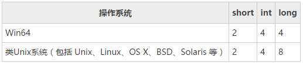
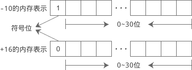

# C语言基础学习

## C语言变量及类型
在定义变量时还要指明数据的长度。而这恰恰是数据类型的另外一个作用。
数据类型除了指明数据的解释方式，还指明了数据的长度。因为在C语言中，每一种数据类型所占用的字节数都是固定的，知道了数据类型，也就知道了数据的长度。




在符号位中，用0表示正数，用1表示负数。例如 int 类型的 -10、+16 在内存中的表示如下：



当数值过大或过小时，有限的几个字节就不能表示，就会发生溢出。发生溢出时，最高位会被截去。

```C
#include <stdio.h>
int main()
{
    unsigned int a = 0x100000000;
    int b = 0xffffffff;
    printf("a=%u, b=%d\n", a, b);
    return 0;
}
```
